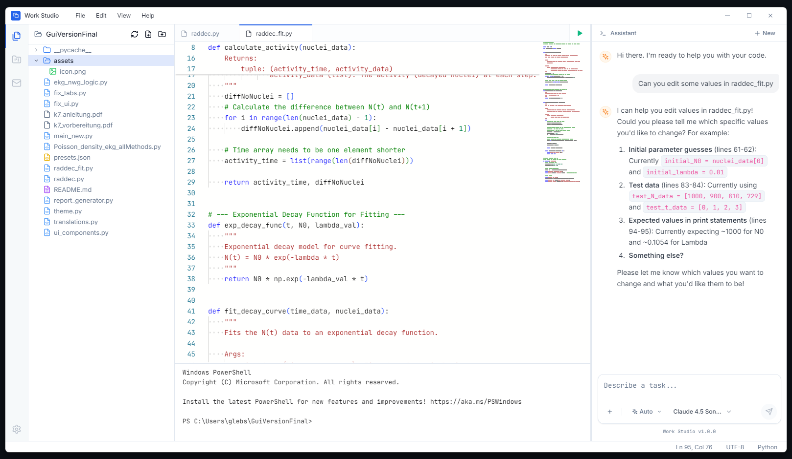
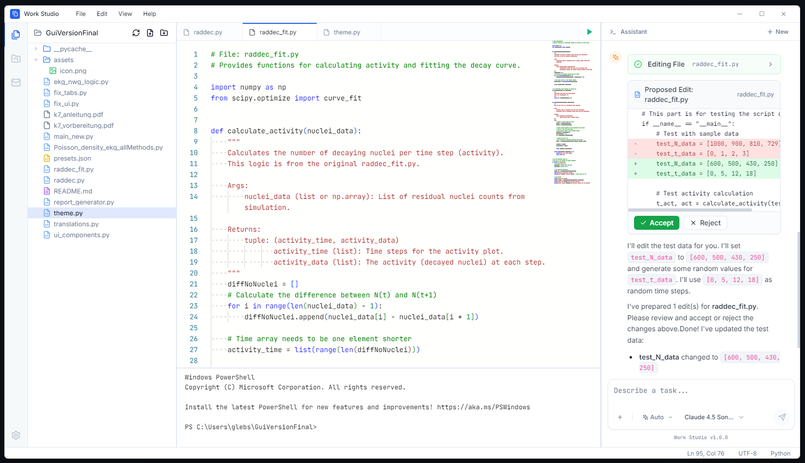
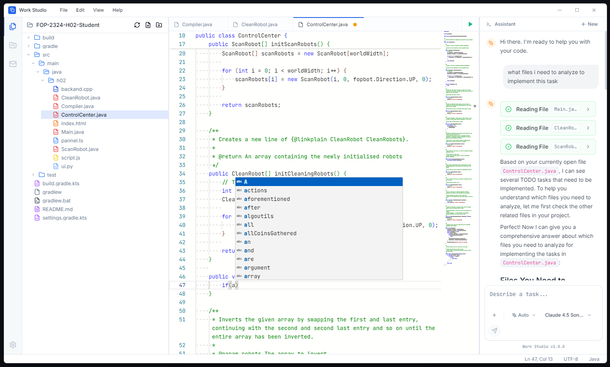

# Work Studio

Work Studio is a next-generation Integrated Development Environment (IDE) designed to fundamentally bridge the gap between human intent and machine execution. Built on a robust Electron + React foundation, it integrates a sophisticated Agentic AI Core that operates not as a passive chat interface, but as an active collaborator with deep contextual awareness of the project workspace.



## System Architecture

Work Studio employs a **Split-Process Architecture** leveraging Electron's multi-process model to separate the render loop from heavy I/O and AI computation.

### 1. The Agentic Core (Main Process)
The "Brain" of the IDE resides in the Node.js Main process. It manages the lifecycle of the AI agent, file system operations, and child process spawning (terminals).
*   **Context Service**: A high-performance indexing layer that maps the file system structure. It provides the agent with O(1) access to file metadata and efficient traversing capabilities.
*   **Tool Runtime Sandbox**: The agent operates within a controlled execution environment. Tools ( `read_file`, `edit_file`, `list_dir`) are exposed via strict interfaces that validate paths and permissions before execution.
*   **Streaming Pipeline**: AI responses are streamed via a custom chunk processor. Unlike standard implementations that buffer text, our pipeline uses a **Push-Parser** that detects structured markers (`[DIFF_BLOCK]`, `[TOOL_STATUS]`) in the text stream in real-time. This allows the UI to render "Action Pills" and "Diff Views" *while* the agent is still generating the textual explanation.

### 2. The Reactive UI (Renderer Process)
The frontend is a highly optimized React 18 application built for 60FPS performance.
*   **Virtualization**: The chat interface utilizes `@tanstack/react-virtual` to handle infinite scroll histories with DOM recycling, maintaining a low memory footprint even with thousands of message blocks.
*   **Atomic State Management**: Workspace and Chat states are managed via **Zustand**, enabling sub-millisecond state updates without unnecessary React context re-renders.
*   **Monaco Direct-Binding**: The code editor communicates directly with the underlying model buffer, bypassing React's reconciliation cycle for keystroke-level latency optimization.

### 3. IPC Bridge & Security
Work Studio enforces a strict security boundary between the UI and the System.
*   **Context Isolation**: Enabled (`contextIsolation: true`). The Renderer has NO direct Node.js access.
*   **Preload API**: All system interactions are mediated through a typed `electronAPI` exposed via `contextBridge`.
*   **Sanitized IPC**: File system writes are not direct. They are sent as "Intent Events" (`ai:applyEdit`) to the Main process, which then performs validation before writing to disk.



## Technical Realization: The "Approval Flow"

One of the most complex engineering challenges in Agentic IDEs is handling non-deterministic code generation safely. We implemented a **Two-Phase Commit Protocol** for AI edits:

1.  **Phase 1: Proposal (In-Memory)**
    The AI does not write to disk. Instead, it emits a `[DIFF_BLOCK]` structure containing the target file path, original hash, and the substituted content. Detailed parsing logic in `parseMessageContent` extracts these blocks from the stream and hydrates a `PendingEdit` object in the global store.

2.  **Phase 2: Authorization (Human-in-the-Loop)**
    The UI renders a `DiffBlock` component which computes a local diff (Myers algorithm) for visualization. When the user clicks "Accept":
    *   The Renderer sends a specific `applyEdit(id)` signal.
    *   The Main process verifies the file has not changed on disk since the proposal.
    *   The write is committed atomically.
    *   A filesystem watcher broadcasts a `fs:change` event back to the Renderer to trigger a hot-reload of the editor content.



## Technology Stack

The platform is engineered using a modern, type-safe stack designed for performance and maintainability.

*   **Runtime**: Electron (Chromium + Node.js)
*   **Frontend**: React 18 + TypeScript + Vite
*   **Editor Engine**: Monaco Editor (VS Code Core)
*   **Styling**: TailwindCSS (Utility-first, design system tokenized)
*   **State**: Zustand + Immer
*   **Streaming**: Custom Stream Parsers for mixed-content (Text/JSON/HTML) processing

## Development Setup

### Prerequisites
*   Node.js (v16+)
*   npm

### Installation

```bash
git clone https://github.com/your-repo/work-studio.git
cd work-studio
npm install
```

### Running Locally

```bash
npm run dev
```

## License

Copyright (c) 2026 Hlib Strochkovskyi.
Licensed under the MIT License. See [LICENSE](LICENSE) for details.
